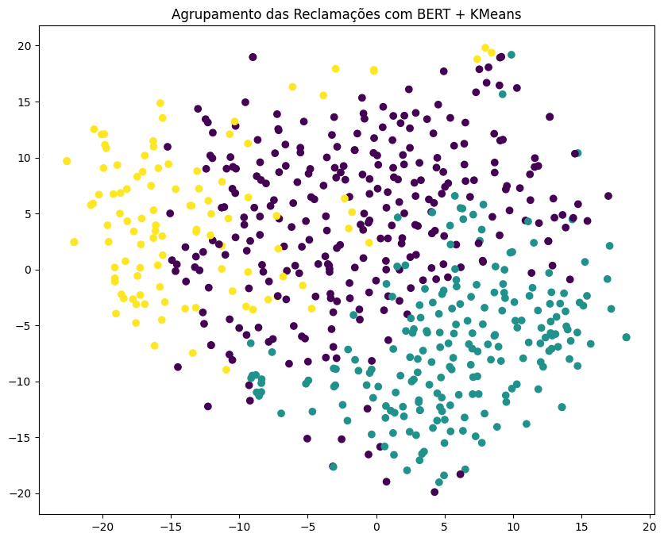
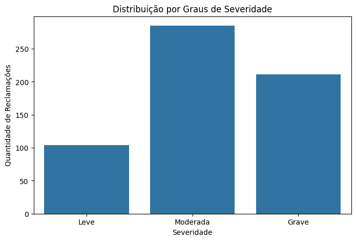

# Análise de Reclamações: Classificando Severidade com PLN (Latam Airlines)
 
## 🎯 Contexto e Problema de Negócio
Empresas recebem milhares de reclamações via Consumidor.gov.br, mas triá-las manualmente por gravidade é lento e inconsistente. Este projeto responde: **é possível usar NLP para agrupar reclamações automaticamente por grau de severidade, sem rótulos prévios?**
 
Esse tipo de solução é aplicável a qualquer área de atendimento ao cliente que precise priorizar casos críticos rapidamente.
 
## 📊 Sobre os Dados
- Fonte: base pública de reclamações do Consumidor.gov.br (Kaggle - beatrizmsarmento/relatos-de-consumidores-do-site-consumidor-gov-br)
- Empresa analisada: Latam Airlines, reclamações de 2024
- Duas representações textuais comparadas: Bag of Words (BoW) e embeddings contextuais (BERT)

## 🔍 O que foi feito
1. **Pré-processamento textual** — limpeza de URLs, e-mails, números isolados, normalização de acentuação e caixa
2. **Representação vetorial** — comparação entre BoW (frequência de palavras) e BERT (embeddings contextuais)
3. **Redução de dimensionalidade e clusterização** — t-SNE para visualização + K-Means sobre os embeddings BERT para identificar grupos de severidade sem supervisão
4. **Discussão crítica** — avaliação do que se ganha e do que se perde em cada etapa do pipeline

## 💡 Principais Insights
 
**BERT supera BoW na similaridade semântica:**
O BoW apresentou scores de similaridade que caem rapidamente entre os resultados mais relevantes (de 0,50 para 0,20), enquanto o BERT manteve scores consistentemente altos, acima de 0,83 para os cinco resultados mais similares — evidência de que embeddings contextuais captam relação semântica mesmo quando o vocabulário exato varia entre reclamações.
 
**O pré-processamento tem um custo, não só benefício:**
A limpeza textual reduziu em média 49% dos tokens originais, simplificando o modelo mas também descartando informação potencialmente relevante — como valores monetários, números de protocolo e pontuação de ênfase (exclamações), que são justamente marcas linguísticas associadas a reclamações mais graves.
 
**Clusterização revela um padrão de severidade coerente:**
Usando K-Means sobre os embeddings BERT, emergiram 3 clusters interpretáveis sem supervisão prévia: reclamações leves (administrativas, ex: pedidos de reembolso simples), moderadas (overbooking, bagagem avariada) e graves (extravio de bagagem, perda de viagem internacional, prejuízos financeiros altos) — o cluster grave se destacou por relatos mais longos e detalhados.
 
## 📈 Visualizações


 
## 🛠️ Ferramentas
Python · NLTK · Scikit-learn (TSNE, KMeans) · BERT (embeddings) · Matplotlib/Seaborn
 
## 📁 Estrutura do Repositório
```
├── notebook/
│   └── analise_reclamacoes_latam.ipynb
├── apresentacao/
│   └── Apresentacao_PLN_Latam.pdf
├── imagens/
│   ├── Imagem1.png
│   └── Imagem2.png
└── README.md
```
 
## 🔗 Links
- Notebook interativo (Colab): https://colab.research.google.com/drive/1m63mp67Tvm_rwMsOGK-K-k-vbCslQxcq?usp=sharing
